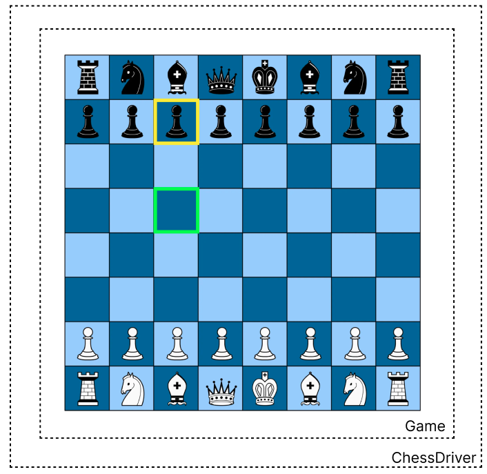
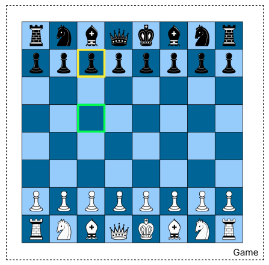
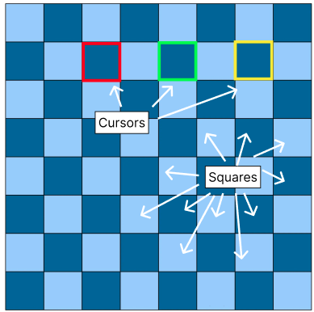
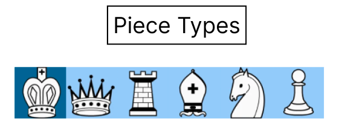
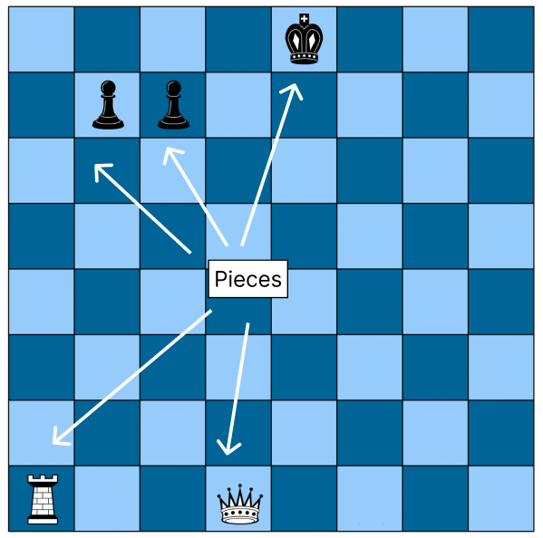

# Chess Implementation
Our implementation of chess on a 64x64 LED Matrix uses a hierarchy of objects for robust logic and interaction with the user via the arduino.

## 1. Game (class):
- **manages game logic**
- defines the current board 
- composed of two Cursors. The existence of two Cursors implies that there are two players, thus we can get away without using a Player class. This saves memory and overhead.

## 2. Cursor (class): 
- **user interaction**
- indexes the board row/col
- simple user interaction: 1. select, 2. move, 3. place

## 3: Square (class): 
- **defines each square on the board**
- 64 squares creates the board inside of the Game class. 
- composed of a piece and a background color

## 4: Piece (struct):
- **no behavior; just a definition of a piece belonging to a square**
- type: PieceType (enum) king, queen, rook, bishop, knight, pawno
- color: white or black (or user defined)

## Driver
Since this is displayed to an LED Matrix, the chess logic must be translated to the LED Matrix.
The object ChessDriver handles this by providing methods to draw the current board state and cursors to the matrix.

## Img Attribution
Screenshots taken (and altered using Figma) from [Britannica](https://www.britannica.com/topic/chess)