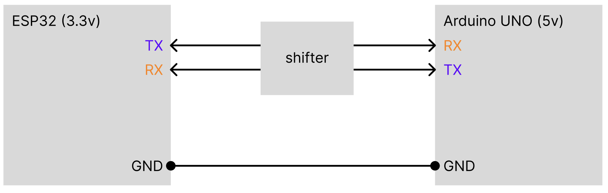

# Communication 

Figure 1: Conceptual diagram for UART between ESP32 and Arduino UNO

We utilized UART to communicate between ESP32 and Arduino UNOs. It was necessary to have two microcontrollers four our project for the capacity to address all 4096 addresses of the 64x64 LED Matrix. Here are the responsibilities of each device:

ESP32: device 1
- drives LED Matrix
- handles most logic for chess game
- responds to user input from Arduino UNO controller.

Arduino UNO: device 2
- user interface for chess game

A level shifter was used to step-up (3.3v to 5v) and step-down (5v to 3.3v) as ESP32 (3.3v) and the Arduino UNO (5v) operate at different logic levels.

## UART configuration
- 8N1
- 9600 baud rate

## Testing UART
To test the communication between these devices, we loaded simple sketches to each device to transmit messages. Each circuit had identical components:
- pushbutton
- message sent LED indicator (red for arduino, blue on-board for ESP32)
- message received LED indicator (green for both)

Figure 2: Sending a message from Arduino UNO to ESP32

Upon pressing a pushbutton on a microcontroller, its transmit (TX) LED lights up and a message is sent over serial.

The Arduino UNO sends the message "arduino tx".
The ESP32 sends the message "ESP32 tx".

If the connected device successfully receives a message, its receive (RX) LED lights up to indicate reception.

A logic analyzer was used to visualize the UART protocol. 

Figure 3: ESP32 (TX) to Arduino UNO (RX) waveform

Figure 4: Arduino UNO (TX) to ESP32 (RX) waveform

## Usage
To interface the chessboard, a simple game controller was created. Using a joystick and buttons, we can encode:
1. Player identity (p1, p2)
2. Action type (move, select, deselect, place)
3. Input source (button, joystick)

This encoding is then decoded by the ESP32 to map the user action on the controller to an action on the chessboard. 

| Input Device | Player | Action Type | Specific Input | Example Message |
|--------------|--------|-------------|----------------|-----------------|
| Button       | p1     | select      | press          | "p1 select"     |
| Joystick     | p2     | move        | left           | "p2 left"       |
| Button       | p2     | place       | press          | "p2 place"      |
| Joystick     | p1     | deselect    | down           | "p1 deselect"   |
Table 1: encoding scheme