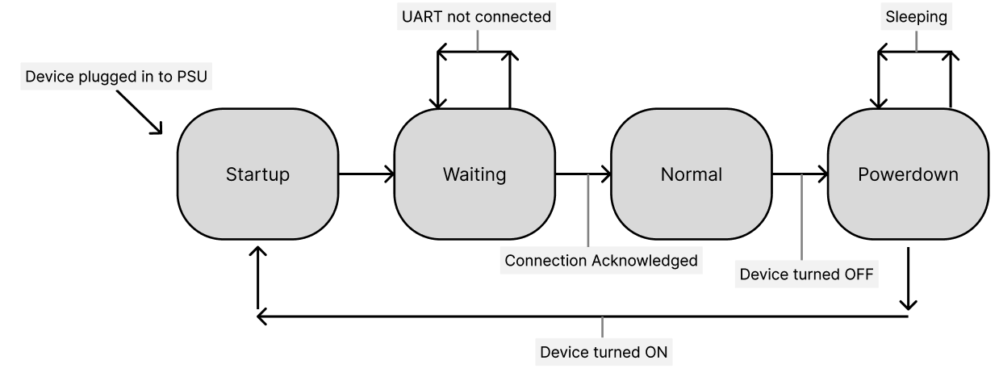

# State Machine
This ESP32xLED Matrix program defines a state machine.

### States:
1. Powerup:
- run initially when plugged into power source or out of sleep mode
- Defines starting display sequence the user sees

2. Waiting:
- after the startup sequence the ESP32 must connect via UART with the arduino
- stay in this state until the connection is confirmed via a handshake

3. Normal:
- normal mode. all use inputs now valid

4. Powerdown:
- sequence ran before setting sleep mode for both the ESP32. 

# FSM

simple FSM depicting conditions for state transitions