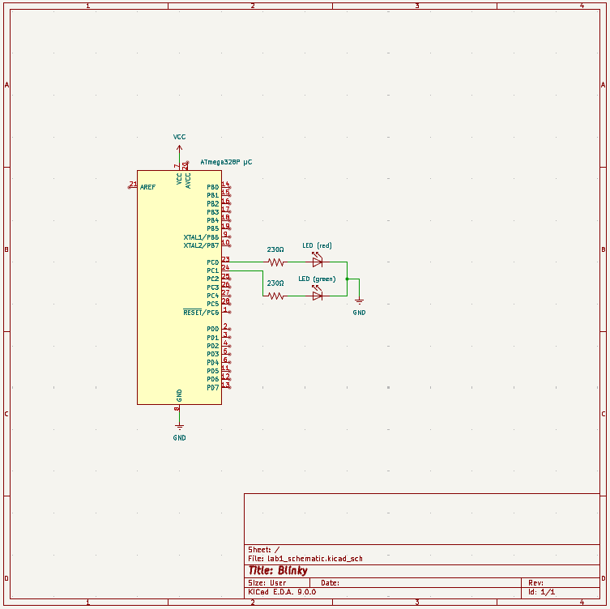

# Lab 1: Blinky

[Home](../../README.md)

## Directions
This lab introduces basic microcontroller programming using the ATmega328P. The program alternates between two LEDs connected to Port B pins (PB1 and PB2), creating a blinking pattern. This serves as a foundation for understanding basic I/O operations, timing, and assembly programming on the ATmega328P platform.

## Circuit

    

    KiCAD Schematic of Lab 1

## Components List

| Component | Quantity |
|:-----------:|:----------:|
| Atmega 328P µC | 1 |
| LED | 2 |
| 220Ω Resistor | 2 |

## Functionality
#### LED Blinking Pattern
- Two LEDs connected to PB1 and PB2
- LEDs alternate in a continuous pattern
- Pattern sequence: PB2 → delay → PB1 → delay → repeat

#### Timing Control
- Program uses precise cycle counting for timing
- Each LED state change includes a delay for visible blinking
- Timing is achieved through software delays

## Source Code 
- [main.asm](../lab1/asm/main.asm): assembly code for lab
