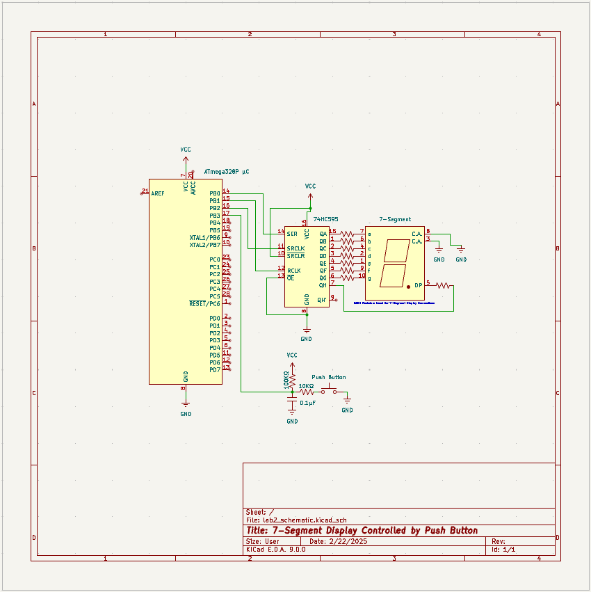

# Lab 2: Counter with 7-Segment Display

[Home](../../README.md)

## Directions
The lab builds a hexadecimal up/down counter. It uses an ATmega328P microcontroller, an 8-bit shift register, a 7-segment LED display, and a pushbutton switch. The 7-segment display shows "0" at power on, and the counter increments by default. The pushbutton controls mode selection, increment/decrement, and reset.

## Circuit

    

    KiCAD Schematic of Lab 2 

## Components List

| Component | Quantity |
|:-----------:|:----------:|
| Atmega 328P µC | 1 |
| 74HC595 Shift Register | 1 |
| 5161AS 7-Segment Display | 1 |
| Enable Low Push Button | 1 |
| 560Ω Resistor | 8 |
| 100KΩ Resistor | 1 |
| 10KΩ Resistor | 1 |
| 0.1µF Capacitor | 2 |

## Functionality
#### Increment Mode
- Press button < 1 second: Increment count by 1
- When display shows "F": Next increment rolls over to "0"

#### Decrement Mode
- Press button < 1 second: Decrement count by 1  
- When display shows "0": Next decrement rolls over to "F"

#### Reset
- Press and hold button ≥ 2 seconds: Reset to "0" and enter increment mode

## References
- [main.asm](../lab2/asm/main.asm): assembly code for lab
- [Lab Report](../lab2/lab_report/es_lab_report_2.pdf): detailed lab report
