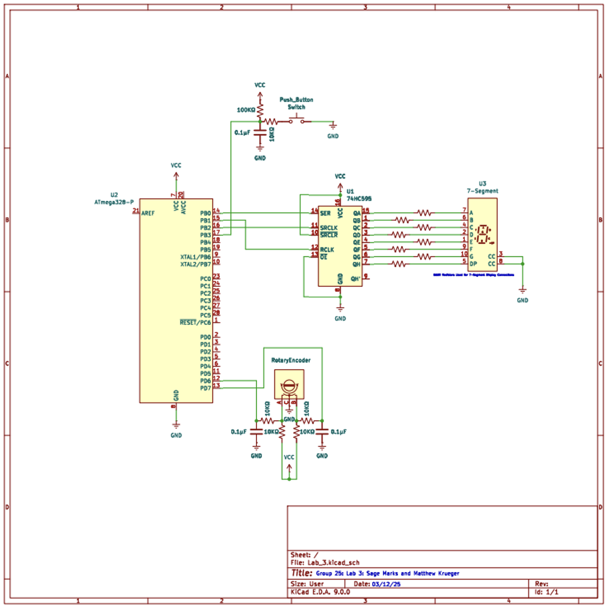

# Lab 3: 7-Segment Display Controlled by Push Button

[Home](../../README.md)

## Directions
The lab builds a simple electrongic lock. It uses an ATmega328P microcontroller, an 8-bit shift register, a 7-segment LED display, and a pushbutton switch. It builds upon [Lab 2](../lab2/lab_report/es_lab_report_2.pdf) by adding a rotary pulse generator to cycle through numbers, and the button to either submit or reset the current password attempt of the user.

## Circuit

    

    KiCAD Schematic of Lab 2 

## Components List

| Component | Quantity |
|:-----------:|:----------:|
| Atmega 328P µC | 1 |
| 74HC595 Shift Register | 1 |
| 5161AS 7-Segment Display | 1 |
| Enable Low Push Button | 1 |
| 560Ω Resistor | 8 |
| 10KΩ Resistor | 5 |
| 100KΩ Resistor | 1 |
| 0.01µF Capacitor | 4 |
| EVE-GA1F2012B Encoder | 1 |

## Functionality
#### RPG Signal Operation
- RPG generates two signals (A and B) when rotated
- Signal logic: 0 = "on", 1 = "off"
- Detents provide tactile feedback through clicking sounds
- Detent position is represented by signal combination 00

#### Clockwise Rotation
- B signal leads A signal (90-degree phase lag)
- Signal pattern (BA): 00 → 01 → 11 → 10 → 00
- Each complete pattern represents one detent movement
- Used to increment displayed value

#### Counterclockwise Rotation
- A signal leads B signal (90-degree phase lag)
- Signal pattern (BA): 00 → 10 → 11 → 01 → 00
- Each complete pattern represents one detent movement
- Used to decrement displayed value

#### Gray Code Implementation
- Uses reflected binary code system
- Only one bit changes at a time (1→0 or 0→1)
- Helps prevent reading errors during transitions
- Signal combination 00 marks the end of each "turn"

#### Increment Mode
- Press button < 1 second: Increment count by 1
- When display shows "F": Next increment rolls over to "0"

#### Decrement Mode
- Press button < 1 second: Decrement count by 1  
- When display shows "0": Next decrement rolls over to "F"

#### Reset
- Press and hold button ≥ 2 seconds: Reset to "0" and enter increment mode

## Source Code 
- [main.asm](../lab3/asm/main.asm): assembly code for lab
