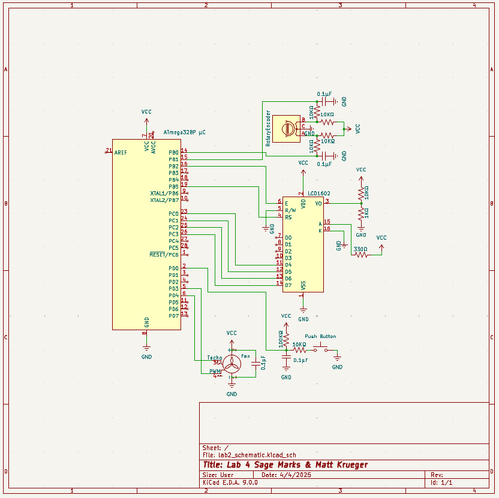

# Lab 4: Pulse Width Modulation Fan 

[Home](../../README.md)

## Directions
This lab explores PWM using the ATmega328P microcontroller. Included in the project is a PWM Fan controlled by input via a Rotary Pulse Generator. The current duty cycle of the fan is displayed by the LCD.

## Circuit

    

    KiCAD Schematic of Lab 4

## Components List

| Component | Quantity |
|:-----------:|:----------:|
| Atmega 328P µC | 1 |
| Enable Low Push Button | 1 |
| Rotary Pulse Generator | 1 |
| 16x2 LCD Display | 1 |
| PWM Fan | 1 |
| 560Ω Resistor | x |
| 10KΩ Resistor | x |
| 0.1µF Capacitor | x |

## Functionality

## References 
- [main.asm](../lab4/asm/main.asm): assembly code for lab
- [Lab Report](../lab4/lab_report/es_lab_report_4.pdf): detailed lab report
